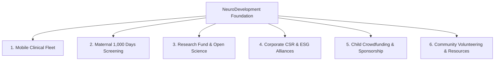

# NeuroDevelopment Foundation (NDF) — Platform Documentation

---

## 1. Executive Summary

**NeuroDevelopment Foundation (NDF)** is a specialized healthcare non-profit trust based in **Dehradun, Uttarakhand, India**, dedicated to decentralized pediatric developmental healthcare, translational neuroscience research, and social equity.

### 🎯 Core Mission:
> *"Transforming Neurodevelopment Through Care, Research & Equity."*

The foundation bridges the critical gap in rural North India (Uttarakhand, Western Uttar Pradesh) where children with **Autism Spectrum Disorder (ASD)**, **Cerebral Palsy**, **Global Developmental Delay (GDD)**, and **speech/motor impairments** face severe geographic, economic, and institutional barriers to early diagnosis and continuous rehabilitation.

---

## 2. Platform Architecture & Technology Stack

```
                                  ┌─────────────────────────────────┐
                                  │      Client Web Application     │
                                  │   (React 18 + Tailwind + CRA)   │
                                  └────────────────┬────────────────┘
                                                   │ HTTPS / REST
                                                   ▼
                                  ┌─────────────────────────────────┐
                                  │       Backend API Service       │
                                  │      (Python FastAPI Server)    │
                                  └────────────────┬────────────────┘
                                                   │
                          ┌────────────────────────┴────────────────────────┐
                          ▼                                                 ▼
             ┌─────────────────────────┐                       ┌─────────────────────────┐
             │       In-Memory /       │                       │    Static Assets &      │
             │   Seed Data Repository  │                       │   Document Toolkits     │
             └─────────────────────────┘                       └─────────────────────────┘
```

### 💻 Technology Stack:

| Layer | Technologies Used | Key Packages / Libraries |
| :--- | :--- | :--- |
| **Frontend Framework** | React 18, React Router v6 | `react-router-dom`, `axios`, `lucide-react` |
| **Styling & UI System** | Tailwind CSS, Radix UI / shadcn | `@radix-ui/react-dialog`, `@radix-ui/react-select`, `@radix-ui/react-accordion`, `sonner` |
| **Backend Engine** | Python 3.10+, FastAPI | `fastapi`, `uvicorn`, `pydantic` |
| **Testing & Quality** | Pytest, React Testing Library | `pytest`, `@testing-library/react` |

---

## 3. Core Strategic Pillars

The platform is designed around 6 interconnected pillars:



1. **Mobile Clinical Fleet**: Fortnightly van-based therapy visits providing Occupational Therapy (OT), Speech & Language Therapy, and Behavioral Coaching directly at rural doorsteps.
2. **Maternal 1,000 Days Protocol**: Milestone tracking integrated into routine antenatal and infant immunization touchpoints (conception to age 2).
3. **Research Fund & Grants**: Ring-fenced independent research fund offering up to ₹40,00,000 per project for low-resource diagnostics, Indian-language AAC technology, and nutritional neuroscience.
4. **Institutional CSR & ESG Hub**: Statutory MCA CSR-1, Section 80G/12A compliance, and quarterly BRSR-aligned reporting for corporate partners with a guaranteed **87% direct program spend**.
5. **Direct Child Crowdfunding**: Verified, clinically costed 1-to-1 funding campaigns for individual children needing therapy cycles and assistive equipment.
6. **Public Education & Volunteering**: Free multilingual downloads (English, Hindi, Garhwali) and structured corporate/individual volunteer programs.

---

## 4. Key Functional Modules & User Journeys

### 4.1. Homepage (`/`)
* **Hero Section**: Highlights foundational statistics (14,820+ screened, 96 villages, 4,380+ caregivers trained, 87% direct spend) with dual CTAs for caregivers and institutional funders.
* **Services Grid**: Interactive presentation of the 4 core programs (Mobile Therapy Fleet, 1,000 Days Screening, Community Training Centers, Holistic Pediatric Rehab).
* **Research Fund & RFP Submission**: Explains grant priorities and contains a modal dialog for Principal Investigators (PIs) to submit grant abstracts and budgets.
* **Open Publications & Policy Briefs**: Searchable and filterable clinical papers, policy briefs, and educator manuals with direct PDF downloads and plain-language summaries.
* **CSR Partnerships Desk**: Dedicated institutional proposal request form with budget band selection and partnership tier benefits.
* **Community Events & Gallery**: Interactive photo gallery and upcoming events (e.g., Annual Clinical Symposium).
* **Free Public Toolkits**: Multilingual downloads for parents and teachers.
* **Institutional Contact Desk**: Multi-department contact form routing to 5 specific desks (Clinics, Research, CSR, Volunteers, Press).

---

### 4.2. Direct Child Crowdfunding (`/crowdfunding`)
* **Campaign Cards**: Displays clinically vetted children requiring therapy funding.
* **Progress Tracking**: Real-time progress bars showing amount needed vs. amount raised.
* **Pledge System**: Interactive modal allowing donors to pledge custom amounts or preset tiers (₹1,000, ₹2,500, ₹5,000, ₹10,000) with 80G tax receipt issuance.

---

### 4.3. Volunteer Management (`/volunteer`)
* **Engagement Modes**: Corporate team days (8–40 participants), clinical training, workshop support, language translation, and logistics.
* **Safeguarding FAQ**: Outlines child-protection protocols, background checks, and supervision policies.
* **Application Form**: Captures skills, organization, mode of contribution, and weekly/monthly availability.

---

## 5. API Endpoints & Data Specifications

The backend exposes a modular RESTful API:

| Endpoint | Method | Description | Request Body / Parameters |
| :--- | :---: | :--- | :--- |
| `/api/team` | `GET` | Retrieve leadership & clinical team | None |
| `/api/publications` | `GET` | List all open-access clinical papers & toolkits | None |
| `/api/events` | `GET` | List milestones, press releases, symposia | None |
| `/api/gallery` | `GET` | Field photographs with verified captions | None |
| `/api/resources` | `GET` | Downloadable parent & educator toolkits | None |
| `/api/campaigns` | `GET` | List active child crowdfunding cases | None |
| `/api/campaigns/{slug}/pledge` | `POST` | Record a donation pledge for a child | `{ name, email, amount_inr }` |
| `/api/grant-proposals` | `POST` | Submit research grant proposal / RFP | `{ principal_investigator, email, organisation, priority_area, abstract, budget_inr }` |
| `/api/csr-requests` | `POST` | Submit CSR partnership inquiry | `{ contact_name, email, company, interest, budget_band, message }` |
| `/api/volunteers` | `POST` | Submit volunteer application | `{ name, email, organisation, mode, skills, availability }` |
| `/api/enquiries` | `POST` | Submit general or desk-specific enquiry | `{ name, email, phone, purpose, district, message }` |

---

## 6. Statutory Compliance & Safeguarding Framework

```
               ┌─────────────────────────────────────────────────────────┐
               │           Trust Deed & Governance Structure             │
               ├────────────────────────────┬────────────────────────────┤
               │  87% Direct Program Spend  │  13% Max Overhead Ceiling  │
               └─────────────┬──────────────┴──────────────┬─────────────┘
                             │                             │
             ┌───────────────▼─────────────┐ ┌─────────────▼───────────────┐
             │    Statutory Compliance     │ │      Child Safeguarding     │
             │ • MCA CSR-1 Registered      │ │ • Mandatory Code of Conduct │
             │ • Section 80G & 12A Tax     │ │ • Full Clinical Supervision │
             │ • Quarterly ESG/BRSR Audits │ │ • Written Caregiver Consent │
             └─────────────────────────────┘ └─────────────────────────────┘
```

1. **Financial Governance**:
   - **87% Spend Ratio**: Mandatory trust charter ensuring maximum capital deployment directly into clinical and field operations.
   - **Tax Exemptions**: Automatic Section 80G certificates issued for all corporate and retail donations.
2. **Child Protection & Ethics**:
   - Every volunteer and staff member adheres to the NDF Child Protection Code.
   - Children are never left unmonitored; all photography requires signed caregiver consent.
3. **Research Ethics**:
   - All research grant outputs must be published under open-access terms without restrictive commercial paywalls.

---

## 7. Developer & Operations Guide

### 7.1. Prerequisites
* **Node.js**: v18.x or higher
* **Python**: v3.10 or higher
* **Package Managers**: `npm` / `yarn` and `pip`

### 7.2. Running the Application Locally

#### 1. Start the Backend:
```bash
cd backend
pip install -r requirements.txt
uvicorn server:app --reload --port 8000
```

#### 2. Start the Frontend:
```bash
cd frontend
npm install
npm start
```
The application will launch on `http://localhost:3000` with API proxying configured to port `8000`.

### 7.3. Running Automated Tests
```bash
# Backend unit & integration tests
cd backend
pytest

# Frontend component & UI tests
cd frontend
npm test -- --watchAll=false
```

---

## 8. Registered Office & Institutional Directory

* **Headquarters**: 12 Rajpur Road, Dehradun 248001, Uttarakhand, India
* **Operating Hours**: Monday to Saturday, 09:30 – 18:00 IST
* **Key Desks**:
  * Mobile Clinic Bookings: `clinics@neurodevfoundation.org`
  * Research Fund & Grants: `research@neurodevfoundation.org`
  * CSR & Partnerships: `partnerships@neurodevfoundation.org`
  * Volunteer Desk: `volunteer@neurodevfoundation.org`
  * Press & Media: `press@neurodevfoundation.org`
